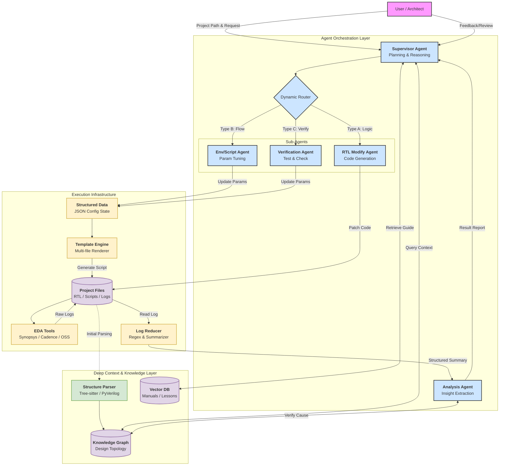
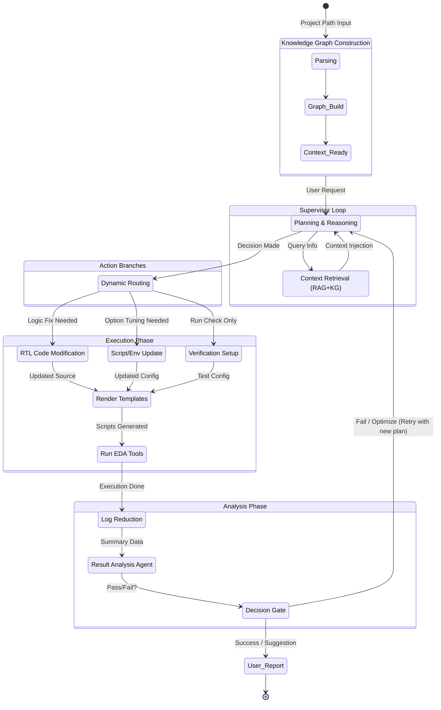

# 자율형 RTL 분석 및 최적화 에이전트 시스템 상세 설계서

**(Autonomous RTL Analysis & Optimization Agent System Design Document)**

## 1. 시스템 개요 (System Overview)

본 시스템은 대규모 반도체 설계(SoC/IP) 프로젝트의 RTL 코드, EDA 스크립트, 대용량 로그 데이터를 통합 분석하고 제어하는 **Neuro-symbolic Agent**입니다.
단순한 텍스트 생성형 AI를 넘어, **Knowledge Graph 기반의 심층 문맥 이해(Deep Context)**와 **상용 EDA 툴의 정교한 제어(Deterministic Execution)**를 결합하여 설계 자동화, 검증(Verification), 디버깅을 수행합니다.

### 핵심 목표

1. **Deep Context Understanding:** 수백만 줄의 RTL 코드 구조와 의존성을 Knowledge Graph로 파악.
2. **Tool Orchestration:** 상용 EDA 툴(Synopsys, Cadence 등)을 템플릿 기반으로 완벽하게 제어.
3. **Self-Correction:** 로그 분석을 통해 스스로 에러를 수정하거나 최적화(PPA)를 반복 수행.

---

## 2. 핵심 아키텍처 (Core Architecture)

시스템은 4가지 계층(Layer)으로 구성되며, 각 계층은 유기적으로 데이터를 주고받습니다.

### A. Supervisor & Planning Layer (두뇌 계층)

* **Supervisor Agent:** 사용자의 자연어 명령("DMA 모듈의 타이밍 위반 해결해줘")을 해석하고 전체 작업 계획(Plan)을 수립합니다.
* **Dynamic Router:** 작업의 성격(RTL 수정, 스크립트 튜닝, 단순 검증)에 따라 하위 에이전트 간의 연결을 동적으로 재구성합니다.

### B. Knowledge & Context Layer (기억 계층)

* **Design Knowledge Graph (KG):**
* RTL 및 스크립트의 AST(구문 트리)를 분석하여 모듈 계층, 신호 연결, 변수 의존성을 그래프로 저장합니다.
* LLM의 Context Window 한계를 극복하기 위해, 문제 해결에 필요한 부분 그래프(Sub-graph)만 추출합니다.

* **RAG Engine (Vector DB):**
* EDA 툴 User Guide, 이전 프로젝트의 Lesson Learned(Jira, Wiki)를 벡터화하여 저장합니다.
* 에러 발생 시 과거 해결 사례나 매뉴얼의 옵션 설명을 검색하여 제공합니다.

### C. Execution & Infrastructure Layer (실행 계층)

* **Template Engine (Jinja2):** 다중 파일 및 계층적 디렉토리 구조를 지원합니다. LLM이 생성한 `Structured Data(JSON)`를 받아 실행 가능한 스크립트(Tcl, Makefile)로 변환합니다.
* **Actual Tools (Muscle):** 렌더링된 스크립트로 실제 EDA 툴을 구동합니다.

### D. Analysis & Feedback Layer (분석 계층)

* **Log Reducer:** 수 GB 단위의 로그/리포트에서 핵심 정보(Error, Warning, Timing Slack)만 정규표현식으로 추출 및 요약(JSON화)합니다.
* **Analysis Agent:** 요약된 데이터를 기반으로 원인을 추론하고, Supervisor에게 재실행 또는 수정을 요청합니다.

---

## 3. 시스템 구조 다이어그램 (Diagrams)

### 3.1 블록 다이어그램 (Block Diagram)

시스템의 구성 요소와 데이터 흐름도입니다.

### 3.2 상태 다이어그램 (State Diagram)

LangGraph 기반의 워크플로우 제어 로직입니다.

---

## 4. 구현 기술 스택 (Implementation Tech Stack)

본 시스템 구축에 필요한 필수 Python 패키지 및 선정 이유입니다.

### A. Agent Core & Orchestration

| 패키지명 | 용도 및 선정 이유 |
| --- | --- |
| **`langgraph`** | StateGraph를 사용하여 에이전트 간 순환(Loop) 및 조건부 라우팅 구현. |
| **`langchain`** | LLM 연동 및 프롬프트 관리. |
| **`pydantic`** | **필수.** LLM의 출력을 엄격한 데이터 스키마로 강제하여 툴 실행 오류 방지. |

### B. Knowledge Graph & Parsing

| 패키지명 | 용도 및 선정 이유 |
| --- | --- |
| **`networkx`** | Design Knowledge Graph를 메모리 상에서 구축하고 탐색. |
| **`tree-sitter-verilog`** | 대용량 RTL 파일의 고속 파싱 및 AST 추출. |
| **`pyverilog`** | 데이터 흐름 분석(Dataflow Analysis) 및 계층 구조 추출. |

### C. RAG & Vector Store

| 패키지명 | 용도 및 선정 이유 |
| --- | --- |
| **`chromadb`** | 로컬 파일 기반의 가벼운 Vector DB (문서 임베딩 저장). |
| **`sentence-transformers`** | 보안 환경(오프라인)에서도 동작하는 텍스트 임베딩 모델. |
| **`unstructured`** | PDF, Markdown 등의 문서 전처리. |

### D. Infrastructure

| 패키지명 | 용도 및 선정 이유 |
| --- | --- |
| **`jinja2`** | 복잡한 계층 구조의 EDA 스크립트(Tcl, Makefile) 자동 생성. |
| **`pandas`** | 로그 데이터의 구조화 및 통계 분석. |

---

## 5. 데이터 처리 파이프라인 (Data Pipeline Strategy)

### 5.1 대규모 코드 파싱 (Deep Context)

1. **입력:** Project Root Directory.
2. **파싱:** `tree-sitter`가 모든 `.v`, `.sv` 파일을 스캔하여 모듈 정의, 포트, 인스턴스 추출.
3. **그래프 구축:** `networkx`를 이용해 모듈 간 `Edge` 연결.
4. **활용:** LLM 요청 시 관련 모듈의 Sub-graph(이웃 노드 2-hop)만 추출하여 프롬프트에 주입.

### 5.2 템플릿 기반 실행 (Execution)

1. **LLM 출력:** `SynthesisConfig` (Pydantic Object).
2. **렌더링:** `Jinja2`가 템플릿 디렉토리 구조를 순회하며 `{{ variable }}` 치환.
3. **파일 생성:** 실제 작업 디렉토리(Work Dir)에 계층 구조 그대로 스크립트 파일 생성.

### 5.3 로그 축소 및 분석 (Log Reduction)

1. **Raw Log:** 수백 MB ~ GB 단위.
2. **Filtering:** Python Regex로 `Error`, `Warning`, `Slack < 0` 라인 및 전후 Context 추출.
3. **Structuring:** 추출된 텍스트를 JSON 리스트로 변환 (`[{"code": "TIM-001", "msg": "..."}]`).
4. **LLM Analysis:** JSON 요약본만 LLM에 입력하여 원인 분석 수행.
